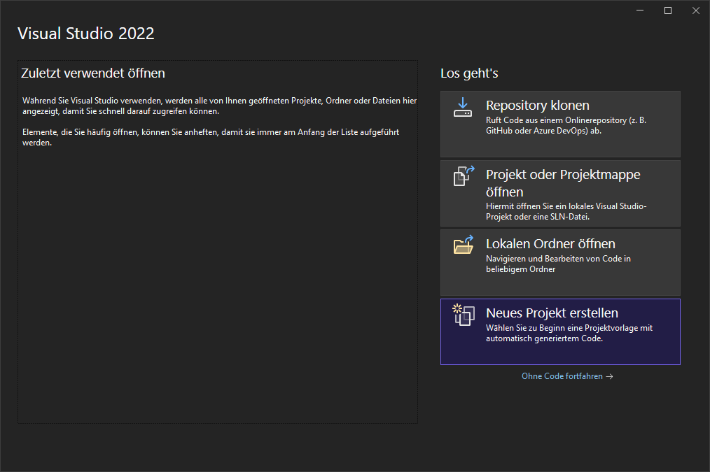
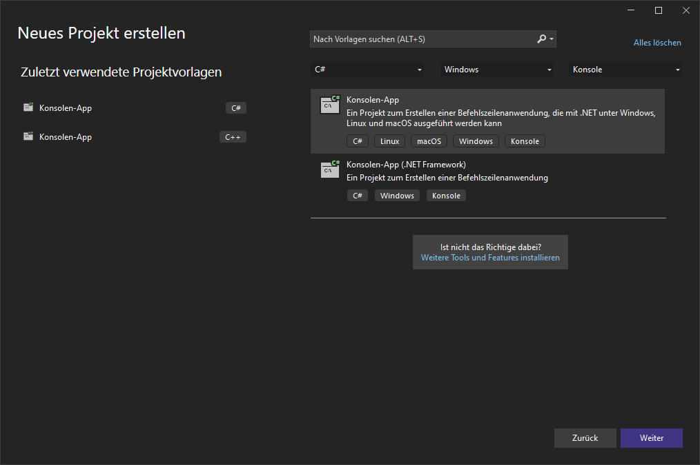
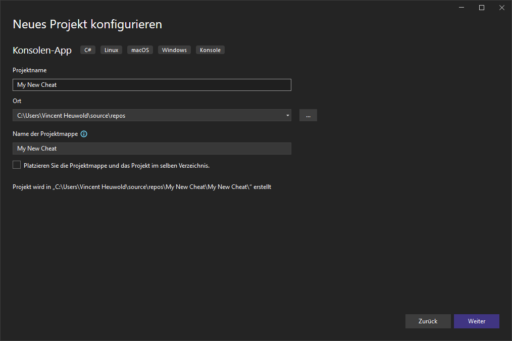
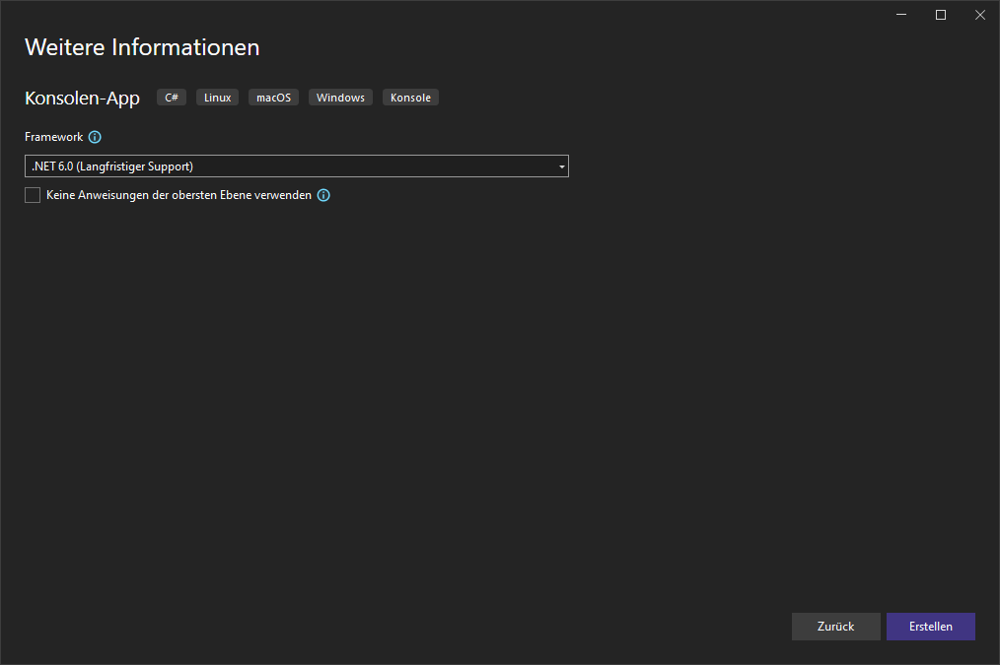
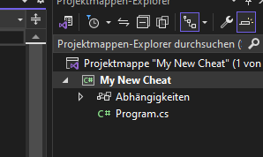

# How to install

1. Open Visual Studio and create a new project.


2. Select Console App with .NET.


3. Choose a Projectname.


4. Select .NET 6.0. If you dont have it, download it with the visual studio installer.


5. The Project should open, Double-Click on the Projectname as shown.


6. Paste the following code to install all needed packages:

```
<ItemGroup>
	<PackageReference Include="ClickableTransparentOverlay" Version="6.2.1" />
	<PackageReference Include="ImGui.NET" Version="1.89.7.1" />
	<PackageReference Include="SixLabors.ImageSharp" Version="3.1.6" />
	<PackageReference Include="Veldrid.ImGui" Version="5.72.0" />
	<PackageReference Include="Vortice.Mathematics" Version="1.6.2" />
</ItemGroup>´´´

