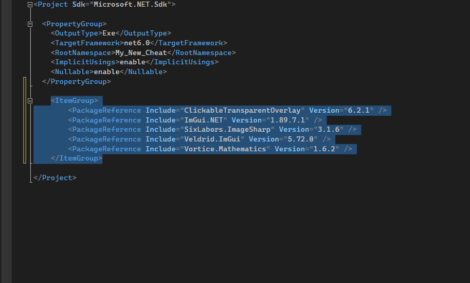
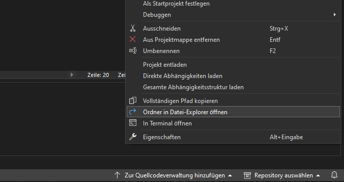
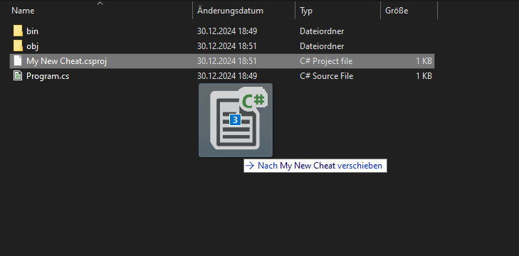
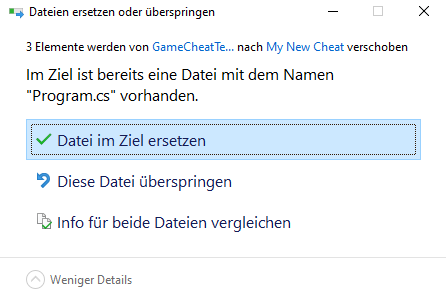
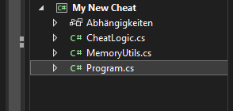
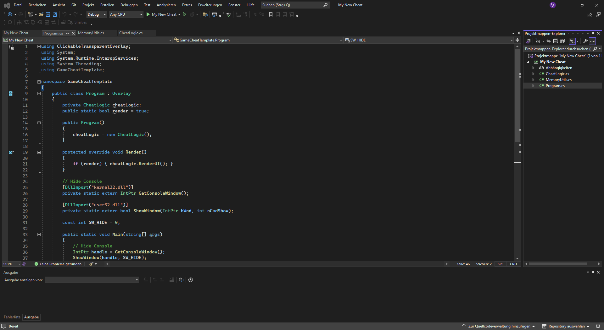
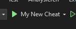
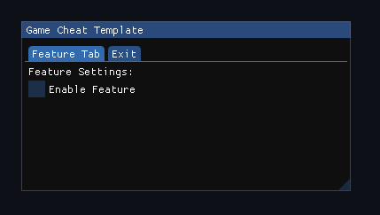

# How to Install

Follow these steps to get started with your project.

### Step 1: Create a New Project
- Open **Visual Studio** and create a new project.
  

### Step 2: Select Console App with .NET
- Choose **Console App** under the .NET section.
  

### Step 3: Choose a Project Name
- Enter a name for your project.
  

### Step 4: Select .NET 6.0
- Ensure **.NET 6.0** is selected. If you don’t have it installed, use the Visual Studio Installer to download it.
  

### Step 5: Open the Project
- After the project loads, double-click on the **ProjectName** in the Solution Explorer to open it.
  

### Step 6: Add Required Packages
- In the project file, paste the following code to install the necessary packages:

  ```csharp
  <ItemGroup>
      <PackageReference Include="ClickableTransparentOverlay" Version="6.2.1" />
      <PackageReference Include="ImGui.NET" Version="1.89.7.1" />
      <PackageReference Include="SixLabors.ImageSharp" Version="3.1.6" />
      <PackageReference Include="Veldrid.ImGui" Version="5.72.0" />
      <PackageReference Include="Vortice.Mathematics" Version="1.6.2" />
  </ItemGroup>
  ```

  

### Step 7: Open the Project in Explorer
- Right-click on the **Project Explorer** and select **Open in Explorer**.
  

### Step 8: Download and Add Scripts
- Download the [Scripts](./scripts) folder, then drag and drop them into your project.
  

### Step 9: Replace `Program.cs`
- Replace the original **Program.cs** with the one from the downloaded scripts.
  

### Step 10: Open and Review Scripts
- Double-click on the scripts in the **Solution Explorer** to open and review them.
  

### Step 11: Verify the Final Setup
- After following all steps, your project should look like this:
  

---

## Test the Project

### Step 1: Start the Project
- Click **Start** to run the project.
  

### Step 2: Verify the Output
- The project should look like this when it runs successfully:
  
